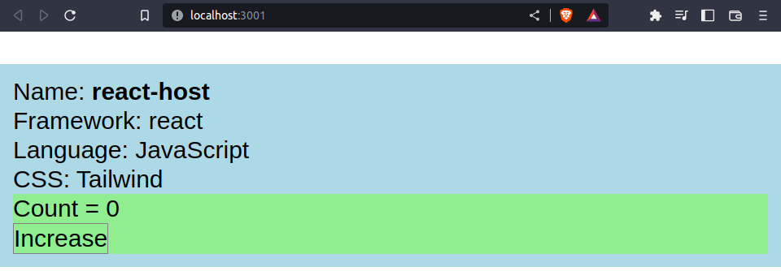

# Microfrontend

## Microfrontend sample-1

With create-mf-app and module federation.

### SolidJS Host

### SolidJS Remote

### ReactJS Host

[Sample 1 README.md](./sample-1/README.md)

## Microfrontend sample-2

With react apps, adding script on head and mounting.

### ReactJS 

- Container (Host)
- Cats
- Dogs

[Sample 2 README.md](./sample-2/README.md)